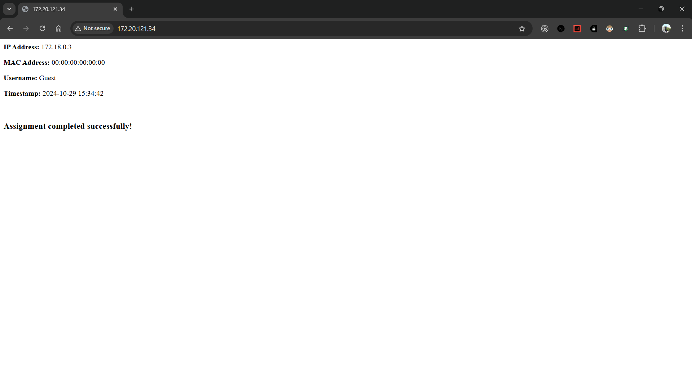
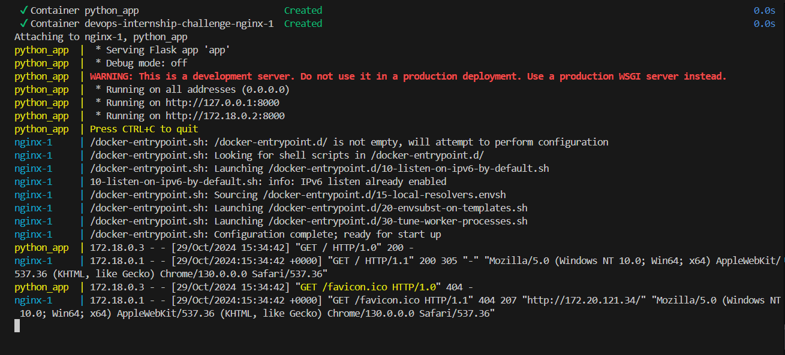

# devops-qoala-assignment-aryangupta-21ucs036
Solution to Qoala assignment

# Project Updates

## Dockerfile Changes

### Nginx Dockerfile
- **Base Image**: 
  - **Changed**: `FROM nginx:latests` 
  - **To**: `FROM nginx:latest`
  
- **Configuration File**: 
  - **Changed**: `COPY nginix.conf /etc/nginx/nginx.conf`
  - **To**: `COPY nginx.conf /etc/nginx/nginx.conf`
  
- **Port Exposure**: 
  - **Changed**: `EXPOSE "eighty"`
  - **To**: `EXPOSE 80`

- **HTML Directory Copy**: 
  - **Removed**: `COPY ./html /usr/share/nginx/html`
  - **Changed**: Destination from `htmll` to `html`

- **Run Command**: 
  - **Changed**: `CMD ["nginx", "-g", "daemon of;"]`
  - **To**: `CMD ["nginx", "-g", "daemon off;"]`

## Nginx Configuration Changes

### Nginx Configuration File (nginx.conf)
- **Worker Processes**: 
  - **Changed**: `worker_process` 
  - **To**: `worker_processes`

- **Worker Connections**: 
  - **Changed**: `worker_connection`
  - **To**: `worker_connections`

- **MIME Types**: 
  - **Changed**: `include /etc/nginx/mime.typess`
  - **To**: `include /etc/nginx/mime.types`

- **Default Type**: 
  - **Changed**: `default_typ`
  - **To**: `default_type`

## Python Application Changes

### Python Application File (app.py)
- **Import Statement**: 
  - **Changed**: `import socket` 
  - **Removed**: Unused import.

- **No Changes**: The rest of the application logic remains unchanged.

## Summary
These changes improve the overall functionality and correctness of the Docker configurations and application logic.

### Individual File Comments
All changes in the individual files are commented for clarity. 

## Final Output

